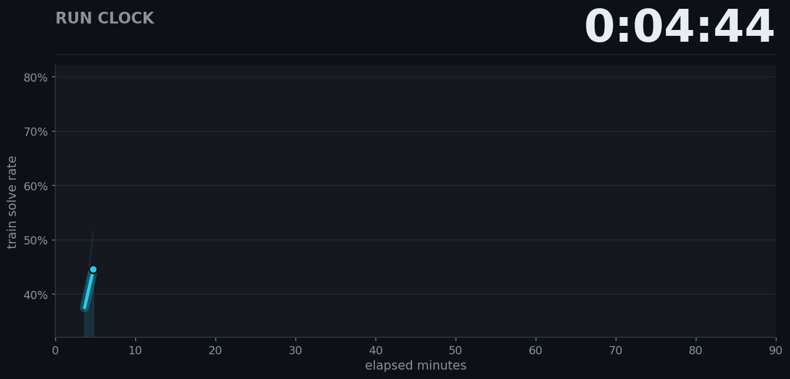

# Sokoban Speedrun

Fastest recipe for RL fine-tuning [Qwen3-4B-Instruct-2507](https://huggingface.co/Qwen/Qwen3-4B-Instruct-2507) from 57% to **>80% held-out pass@1** solve-rate on Sokoban puzzles, using a single **8xH100** node.

[Play Sokoban](https://www.jeankaddour.com/sokoban) if the task is unfamiliar.

<p align="center">
  
</p>

## World Record History

| #   | Record time | FLOPs       | Description                        | Date       | Log                                                  | held-out pass@1         | Contributors |
| --- | ----------- | ----------- | ---------------------------------- | ---------- | ---------------------------------------------------- | ----------------------- | ------------ |
| 1   | 1:27:31     | 1.251 EFLOP | GRPO, LR 1.6e-6 annealed, 75 steps | 2026-06-17 | [records/2026-06-17_01](records/2026-06-17_01_grpo/) | 0.891 (CI [0.86, 0.92]) | @JeanKaddour |

## Rules

Fastest wall-clock run wins: one training run on one 8xH100 node, measured from training step 1 through final checkpoint write, whose final checkpoint clears the target.

- **Target:** lower 95% bootstrap CI > 0.80 on [datasets/sokoban_eval.jsonl](datasets/sokoban_eval.jsonl).
- **Eval:** 8 completions/puzzle, 12,288 tokens, temperature 0.8, top-p 0.95, seed 12345.
- **Fixed:** model, [train set](datasets/sokoban_train.jsonl), eval set, reward function, hardware.
- **Open:** RL algorithm, loss, schedules, engine, parallelism, domain-agnostic rewards, prompt.
- **Not allowed:** Sokoban-specific hints, heuristics, or few-shot examples.
- **Verification:** maintainers rerun at a second seed; both runs must clear the target.

### Submit

1. Train, then eval the final checkpoint. Logs, rollouts, and eval JSON are written automatically.
2. Run `python make_record_report.py records/<your-dir>` and fill in the `Idea` section.
3. Open a PR adding the record directory plus a leaderboard row. CI runs `python verify_record.py records/<your-dir>`.

## Running the current record

On a local 8xH100 node:

```bash
NODE_GPUS=8 torchrun --standalone --nproc_per_node=3 -m speedrun
```

### Modal

`modal_app.py` rents an 8xH100 box on [Modal](https://modal.com). Upload the datasets once, then start a run and eval its checkpoint after it finishes:

```bash
modal volume put nanochat-rl-hf datasets/sokoban_train.jsonl /datasets/sokoban_train.jsonl
modal volume put nanochat-rl-hf datasets/sokoban_eval.jsonl /datasets/sokoban_eval.jsonl
modal run --detach modal_app.py
EVAL_CHECKPOINT=latest modal run modal_app.py
```

## Credits

Thanks to [@joshua-a-harris](https://github.com/joshua-a-harris/fundoku), [nanochat](https://github.com/karpathy/nanochat), [modded-nanoGPT](https://github.com/KellerJordan/modded-nanogpt), [nanoRL](https://joshuaharrissite.substack.com/p/nanorl), [ScaleRL](https://arxiv.org/abs/2510.13786), and [ReasoningGym](https://github.com/open-thought/reasoning-gym).
