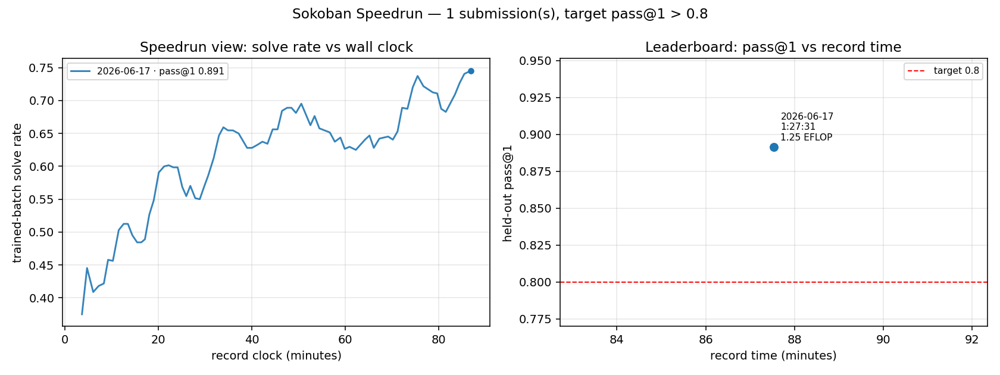

# Sokoban Speedrun

Goal: the fastest recipe to RL [Qwen3-4B-Instruct-2507](https://huggingface.co/Qwen/Qwen3-4B-Instruct-2507) from 57% to **>80% pass@1** solve-rate on Sokoban puzzles, using a single **8xH100** node.

Sokoban: If you don't know it, the best way to familiarize yourself with it is [to play it here](https://www.jeankaddour.com/sokoban).

Motivation: A lot of LLM RL papers don't reproduce and there are many high-variance moving parts in their pipelines. This is an attempt to standardize things with a setup cheap and fast enough that a full train+eval iteration costs ~$50 and about two hours.

Acknowledgements and contributors: [@joshua-a-harris](https://github.com/joshua-a-harris/fundoku)

# World record history


| #   | Record time | FLOPs | Description                          | Date       | Log                                                      | pass@1                 | Contributors |
| --- | ----------- | ----------- | ------------------------------------ | ---------- | -------------------------------------------------------- | ---------------------- | ------------ |
| 1   | 1:27:31     | 1.251 EFLOP | GRPO, LR 1.6e-6 annealed, 75 steps   | 2026-06-17 | [records/2026-06-17_01](records/2026-06-17_01_grpo/) | 0.891 (CI [0.86, 0.92]) | @JeanKaddour |

Ranked by record time: the wall-clock from training step 1 to the final checkpoint. FLOPs is shown for reference, not scored — it's node-invariant, so it tracks a recipe's compute efficiency on its own, separate from how fast a given node happens to be.


Each record links its full training log and eval JSON in the `[records/](records/)` directory, and its own page explains how the numbers were measured.



*Every submission summarized in one view (`python plot_leaderboard.py`, regenerated as records land): each recipe's solve-rate-vs-wall-clock trajectory on the left, and its held-out pass@1 against record time (annotated with the run's FLOPs) on the right.*

# Rules

- **Submission.** One training run whose final checkpoint clears the target. The record is wall-clock time, measured from training step 1 to the moment the final checkpoint finishes writing. We also report each run's FLOPs for reference.
- **Target.** pass@1 above **0.80** on the held-out eval set `[datasets/sokoban_eval.jsonl](datasets/sokoban_eval.jsonl)`, cleared by the lower 95% bootstrap CI. The base model scores 57.3% (CI [0.52, 0.63]).
- **Eval.** 8 completions per puzzle, a 12,288-token budget, temperature 0.8, top-p 0.95, and eval seed 12345. It takes about 10 minutes on the node.
- **Fixed.** The base model (Qwen3-4B-Instruct-2507), the training set `[datasets/sokoban_train.jsonl](datasets/sokoban_train.jsonl)` (4,000 puzzles, used in file order), the eval set, and the reward function.
- **Free to change.** The RL algorithm, loss, schedules, training and inference engine, parallelism, domain-agnostic auxiliary rewards (e.g. entropy or uncertainty proxies), and the prompt — as long as you add no Sokoban-specific solving knowledge (see FAQ).
- **Hardware.** One 8xH100 node.
- **One run per submission.** No seed-averaging, so a submission stays a single ~$50 run. The result counts because the lower 95% bootstrap CI over the 100 eval puzzles has to clear the target, and run-to-run variance is small (σ ≈ 0.02 across our baseline's seeds).
- **Honor system.** Wall-clock carries some node-to-node variance, so beat the record by a clear margin rather than a few seconds. Following [modded-nanoGPT](https://github.com/KellerJordan/modded-nanogpt), every record is reproduced at a second seed before it merges, and a rerun that fails the target voids it — for record #1 the rerun landed within ~1.5% (1:27:31 vs 1:28:48).

## Submitting a record

1. Train with your recipe, then run the eval on the final checkpoint. All artifacts are written automatically: run log, `final_rollouts.jsonl.gz`, eval JSON + eval rollouts.
2. Run `python make_record_report.py records/<your-dir>` to generate the standard plots and the per-record README, write its `Idea` section, then open a PR adding the directory plus a row in the table.
3. The PR must pass `python verify_record.py records/<your-dir>` (offline re-scoring of every eval completion + health checks).

**Verification.** Every record is confirmed by an independent rerun before merging. The maintainers re-run the recipe at a different seed and drop that run into a `verification/` subfolder of the record — itself a mini-record (`train_log_seed<V>.txt`, `eval_seed<V>.json` + rollouts, and a one-line `verifier.txt`). `verify_record.py records/<dir>` then re-scores both the submission and the verification, and **both must clear the target by their lower 95% CI** — a verification rerun that fails voids the record. `make_record_report.py` renders the result as a `## Verification` section. (For our own early records we run both seeds ourselves and mark them self-verified.)

# How it works

`speedrun.py` is a self-contained async RL pipeline in one file, designed to run on one 8xH100 node using `torch` and `vllm`.

Two roles share the node's 8 GPUs:

- **Generators**: five vLLM processes (one GPU each, data-parallel) sample completions for each puzzle.
- **Trainers**: three fp32 ranks (one GPU each) score the rollouts, update the policy, and broadcast fresh weights to the generators over NCCL.

The two run concurrently, so the generators never idle waiting for a step. The 3-trainer / 5-generator split is the sweet spot on this node: at fewer trainers the step is generation-bound, at more it's generator-starved. The benchmark recipe lives at the top of `speedrun.py` as the `RECIPE` constant — any CLI flag overrides it. fp32 is mandatory (the model ties its `lm_head` to the input embedding; lower precision desyncs the tied head across the trainer/generator boundary).

**The reward function.** The environment scores each attempt by *progress toward a solution*: the fraction of the puzzle's initially-uncovered goals that the moves end up covering, with full credit (1.0) only for a complete solve and zero for doing nothing or regressing (the moves are replayed in ReasoningGym's game engine). The dense signal gives a smooth, *rising* training curve and a usable gradient even on puzzles the model can't yet fully solve. **Records are graded on binary pass@1**, so this reward is purely the training signal.

## How to run

On an 8xH100 node — the full benchmark recipe is the `RECIPE` constant in `speedrun.py`, so a bare launch reproduces it:

```bash
python -m speedrun --run myrun --max-steps 75
```

## Modal

If you'd rather not manage a node yourself, `modal_app.py` rents an 8xH100 box on [Modal](https://modal.com) and launches the recipe:

```bash
# one-time: push the fixed datasets to the Modal volume
modal volume put nanochat-rl-hf datasets/sokoban_train.jsonl /datasets/sokoban_train.jsonl
modal volume put nanochat-rl-hf datasets/sokoban_eval.jsonl /datasets/sokoban_eval.jsonl

# train (use --detach so the run survives the client disconnecting)
MAX_STEPS=75 RUN_NAME=myrun modal run --detach modal_app.py

# evaluate the final checkpoint under the leaderboard protocol (reuse RUN_NAME so the
# eval JSON lands under outputs/myrun/ alongside the run log and rollouts)
EVAL_CHECKPOINT=/vol/outputs/myrun/step_000074 RUN_NAME=myrun modal run modal_app.py
```

`modal_app.py` defaults to the 8xH100 node. `NUM_GPUS` sizes the Modal allocation and is baked into the container as `NODE_GPUS`, which `speedrun.py` reads to derive its trainer/generator split.

# FAQ

## Why Sokoban?

- Small contamination risk: We generate fresh puzzles, so unlike eg. GSM8k there is less risk the base model has memorized them.
- Simple enough to yield RL gains in `O(10)` GPU hours — here, `O(5)`.
- Hard enough for gains to be meaningful: Sokoban is PSPACE-complete and can't be brute-forced; it requires genuine reasoning capabilities.
- Naturally disincentivizes entropy collapse, as puzzles naturally permit multiple solutions.

## Why Qwen3-4B-Instruct-2507?

- Its base pass@1 on the eval set is 57.3% (CI [0.52, 0.63], under the leaderboard protocol).
- It is a model whose RL gains are unambiguous reasoning gains, measured three ways:
  - pass@1 0.573 → **0.891** (the record);
  - solve-rate-given-an-answer rises 0.586 → 0.89 — the gain is solving, not answer formatting;
  - the pass@8 ceiling is already 0.99 at base (vs 0.573 pass@1), so RL's job is to **convert that latent capability into reliable pass@1** — the wide base pass@8→pass@1 gap is what makes the climb steep.
- We use the **non-thinking** Instruct-2507 variant: on Sokoban it matches the Thinking-2507 variant's accuracy at roughly half the generated tokens (thinking buys ~no accuracy here but doubles the rollout length), and ~doubles the solve-rate of the older Qwen3-1.7B.
- A capability study across difficulty bands showed the binding constraint is **plan depth**, not box count — the datasets are calibrated to the model's frontier (depth-12, 2-box puzzles; see below).

## Why handroll an async RL stack instead of using verl/slime/TRL/etc.?

- Since wall-clock time to a target solve-rate is the metric, the RL stack itself is part of the optimization target.
- General-purpose RL frameworks optimize for broad coverage; here we want a narrow, inspectable fast path.
- This follows the spirit of [modded-nanoGPT](https://github.com/KellerJordan/modded-nanogpt): strip the stack down until bottlenecks are visible, then make the fastest version easy to reproduce and improve.

## What prompt changes are allowed?

- The point of the benchmark is generalizable reasoning, not overfitting to Sokoban.
- Changes are allowed as long as they remain **domain-agnostic**: generic reasoning scaffolds ("plan, then verify each step"), output-format or termination guidance, self-check instructions.
- What's not allowed are Sokoban strategy hints, heuristics, or deadlock rules ("don't push a box into a goal-less corner"), and no worked examples (zero-shot).

# Shoutouts

- [nanochat](https://github.com/karpathy/nanochat): We forked [chat_rl.py](https://github.com/karpathy/nanochat/blob/master/scripts/chat_rl.py)
- [modded-nanoGPT](https://github.com/KellerJordan/modded-nanogpt): The OG of LLM speedruns, and the template for these rules
- [nanoRL](https://joshuaharrissite.substack.com/p/nanorl): Fundoku RL LLM speedrun
- [ScaleRL](https://arxiv.org/abs/2510.13786): Our initial recipe took a lot of inspiration from theirs
- [ReasoningGym](https://github.com/open-thought/reasoning-gym) provided the Sokoban implementation
