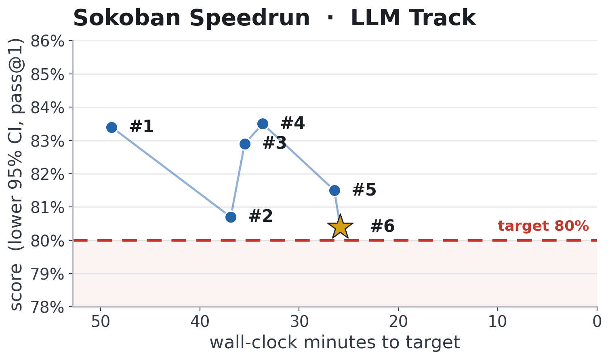
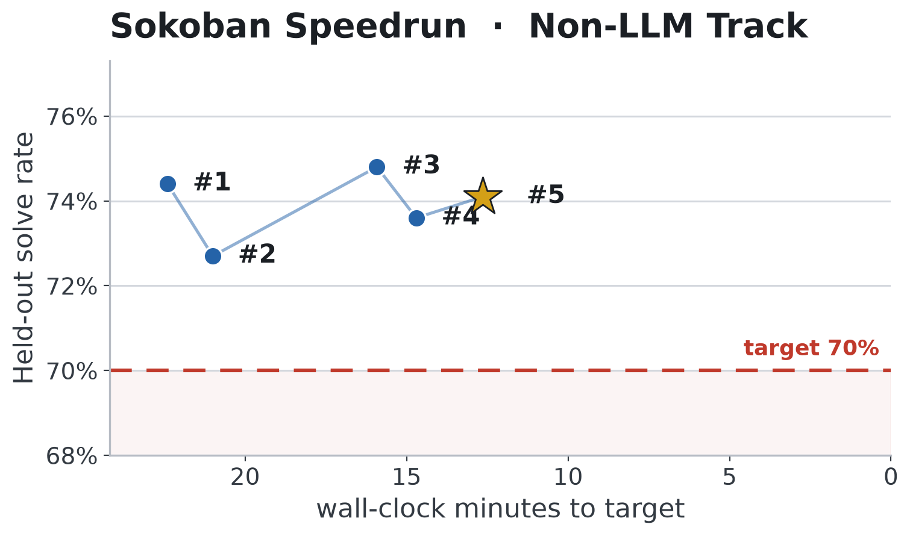

# Sokoban Speedrun

Fastest recipes to RL models to solve Sokoban to a held-out target on one node:

- **[LLM Track](#llm-track)**: RL-fine-tune [Qwen3-4B-Instruct-2507](https://huggingface.co/Qwen/Qwen3-4B-Instruct-2507) from 57% to **>80% held-out pass@1** on one **8xH100**.
- **[Non-LLM Track](#non-llm-track)**: train a **from-scratch** agent on a **single H100**.

[Play Sokoban](https://www.jeankaddour.com/sokoban) if the task is unfamiliar.


## LLM Track

### World record history



| #   | Record time (mm:ss) | Description                        | Date       | Log                                                          | score | Contributors |
| --- | ------------------- | ---------------------------------- | ---------- | ------------------------------------------------------------ | ----- | ------------ |
| 1   | 48:53               | GRPO, LR 1.6e-6 annealed, 75 steps | 2026-06-29 | [llm/records/2026-06-29_01](llm/records/2026-06-29_01_grpo/) | 0.834 | @JeanKaddour |
| 2   | 36:53               | steps + LR-decay horizon 75 → 60   | 2026-06-29 | [llm/records/2026-06-29_02](llm/records/2026-06-29_02_grpo_60step/) | 0.807 | @dexhunter   |
| 3   | 35:29               | earlier stop: 54 steps             | 2026-07-02 | [llm/records/2026-07-02_01](llm/records/2026-07-02_01_grpo_54step/) | 0.829 | @dexhunter   |
| 4 | 33:40 | Weco advantage shaping, 52 steps | 2026-07-02 | [llm/records/2026-07-02_02](llm/records/2026-07-02_02_weco_strategy_52step/) | 0.835 | @dexhunter |
| 5 | 26:27 | rollout budget 5632 → 4800 tokens, 48 steps | 2026-07-02 | [llm/records/2026-07-02_03](llm/records/2026-07-02_03_grpo_48step/) | 0.815 | @lorenzflow |
| 6 | 25:51 | GRPO → CISPO, same 48-step recipe | 2026-07-14 | [llm/records/2026-07-14_01](llm/records/2026-07-14_01_weco_cispo_48step/) | 0.804 | @lorenzflow |


### Rules

Fastest wall-clock run wins: one run on one 8xH100 node, from training step 1 through the final training update.

- **Score:** the lower 95% bootstrap CI of pass@1 on [llm/datasets/sokoban_eval.jsonl](llm/datasets/sokoban_eval.jsonl) — a record must score > **0.80**.
- **Eval:** 8 completions/puzzle, 12,288 tokens, temperature 0.8, top-p 0.95, seed 12345.
- **Fixed:** model, [train set](llm/datasets/sokoban_train.jsonl), eval set, reward function, hardware.
- **Open:** RL algorithm, loss, schedules, engine, parallelism, domain-agnostic rewards, prompt.
- **Not allowed:** Sokoban-specific hints, heuristics, or few-shot examples.
- **Verification:** Rerun with a second seed; both runs must score above the target. The score column reports the worse of the two runs.

### Running

```bash
cd llm
uv sync
NODE_GPUS=8 uv run torchrun --standalone --nproc_per_node=3 -m speedrun
uv run python -m eval_speedrun --eval-checkpoint outputs/<run>/step_000051
```

## Non-LLM Track

This track uses [PufferLib's](https://github.com/pufferai/pufferlib) Boxoban environment; the initial PPO implementation was forked from [pufferlib/torch_pufferl.py](https://github.com/PufferAI/PufferLib/blob/4.0/pufferlib/torch_pufferl.py).

### World record history



| #   | Record time (mm:ss) | Description     | Date       | Log                                                                     | score | Contributors |
| --- | ------------------- | --------------- | ---------- | ----------------------------------------------------------------------- | ----- | ------------ |
| 1   | 22:24               | cnn-mingru h256 | 2026-06-21 | [non_llm/records/2026-06-21_01](non_llm/records/2026-06-21_01_non_llm/) | 0.718 | @JeanKaddour |
| 2 | 21:00 | same recipe as #1, earliest clearing checkpoint | 2026-06-29 | [non_llm/records/2026-06-29_01](non_llm/records/2026-06-29_01_non_llm/) | 0.701 | @JeanKaddour |
| 3 | 15:55 | torch.compile + steps-matched-anneal | 2026-06-30 | [non_llm/records/2026-06-30_01](non_llm/records/2026-06-30_01_non_llm/) | 0.706 | @JeanKaddour |
| 4 | 14:42 | anneal horizon tuned 1300→1200 steps | 2026-07-02 | [non_llm/records/2026-07-02_01](non_llm/records/2026-07-02_01_non_llm/) | 0.709 | @JeanKaddour |
| 5 | 12:38 | conv-free shift + pooled-global encoder (`sgpm2`), 950-step anneal | 2026-07-02 | [non_llm/records/2026-07-02_02](non_llm/records/2026-07-02_02_non_llm/) | 0.715 | @srijanpatel |


### Rules

Fastest wall-clock run wins: one run on a single H100, from training step 1 through the final training update.

- **Score:** the lower 95% CI of the held-out solve rate — a record must score > **0.70**.
- **Eval:** official [DeepMind Boxoban](https://github.com/google-deepmind/boxoban-levels) test split `unfiltered/test`.
- **Open:** policy architecture, RL algorithm, optimizer, schedules, implementation.
- **Verification:** Rerun with a second seed; both runs must score above the target. The score column reports the worse of the two runs.

### Running

```bash
cd non_llm
uv sync
uv run python speedrun.py
```

## Submitting a record

Each track's `assemble_record.sh` ([`llm/`](llm/assemble_record.sh), [`non_llm/`](non_llm/assemble_record.sh)) turns a finished run into a record dir: it collects the log, eval JSON, and source snapshot, builds the report, pins the top-level `speedrun.py`, runs `verify_record.py`, and adds the record's row + redraws the leaderboard figure. Configure record runs by editing `RECIPE` in `speedrun.py` and launch them flag-free — the pinned `speedrun.py` then *is* the recipe (assembly rejects flag-configured runs). It reads a local `outputs/<RUN>/` by default; pass `SOURCE=modal` to pull off the volume.

1. **Train + eval** with your track's [Running](#running) commands.

2. **Assemble** the record:

   ```bash
   cd llm        # or: cd non_llm
   RUN=<RUN> DEST=records/<date>_01_<name> ./assemble_record.sh
   ```

   The record's `README.md` is scaffolded with a placeholder **`## Idea`** section. Review the pinned `speedrun.py` diff, then fill in by hand: the record's `## Idea`, and the new leaderboard row's **Description** + **Contributors** in this top-level `README.md`.

3. **Open a PR** with the record dir + new row.

*Optional:* verify it yourself with a second seed (otherwise the maintainers do; either way both seeds must clear the target), assembled into the record's `verification/` subdir:

```bash
RUN=<VRUN> VERIFY_OF=records/<date>_01_<name> ./assemble_record.sh
```

The top-level `speedrun.py` files always hold the current record's recipe.

## Credits

[@joshua-a-harris](https://github.com/joshua-a-harris)'s [nanoRL speedrun](https://joshuaharrissite.substack.com/p/nanorl), [nanochat](https://github.com/karpathy/nanochat), [modded-nanoGPT](https://github.com/KellerJordan/modded-nanogpt), [ScaleRL](https://arxiv.org/abs/2510.13786), [ReasoningGym for the LLM-track Sokoban env](https://github.com/open-thought/reasoning-gym), [DeepMind for Boxoban](https://github.com/google-deepmind/boxoban-levels) and [PufferLib for the efficient `boxoban` implementation](https://github.com/PufferAI/PufferLib).
