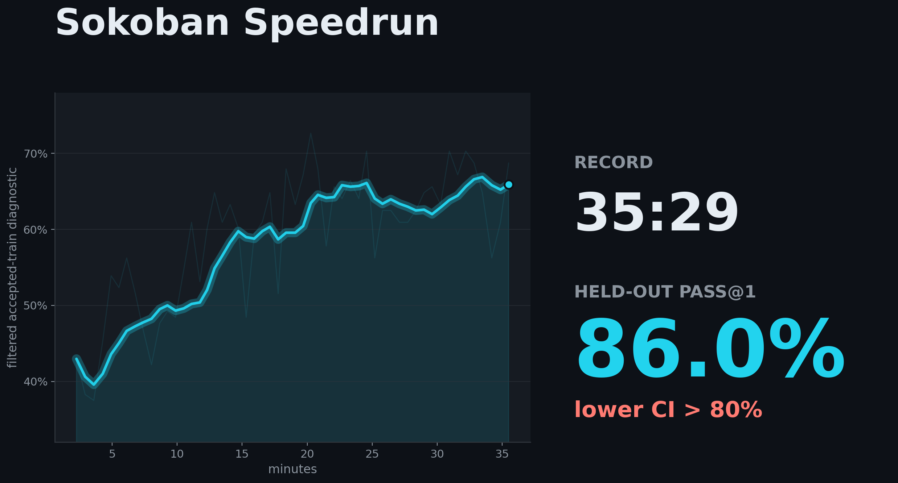
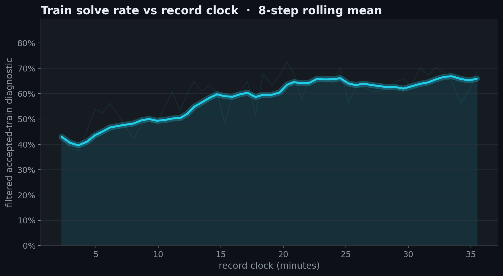
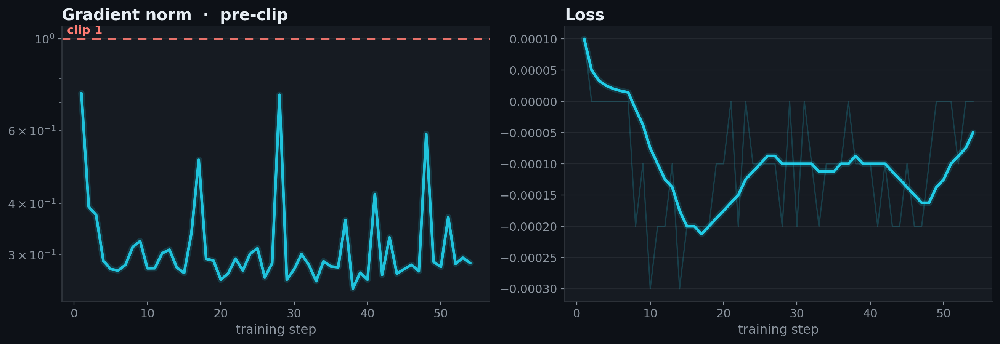
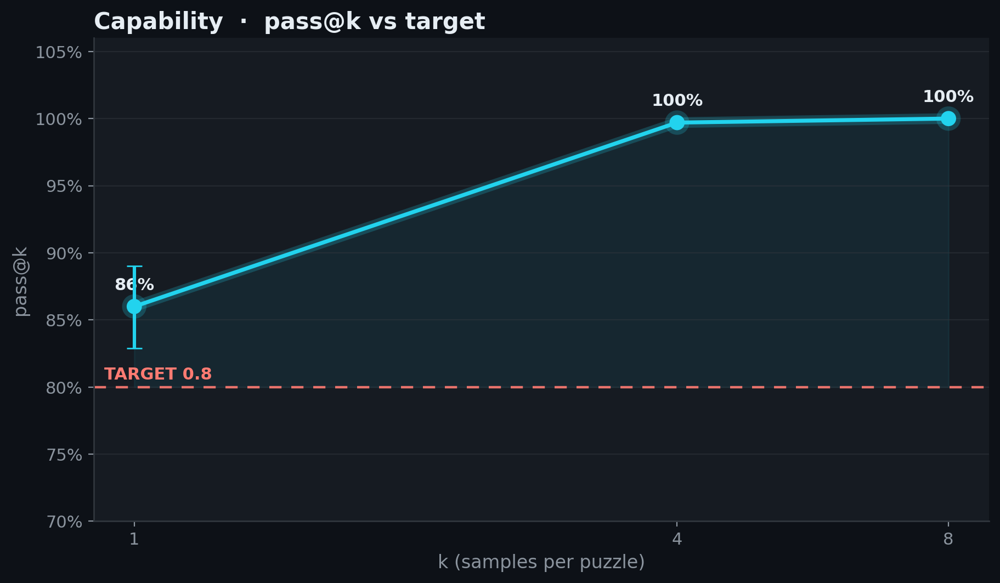

# 2026-07-02_01_grpo_54step

## Idea

A shorter GRPO run than the 60-step record ([`2026-06-29_02`](../2026-06-29_02_grpo_60step/)): the
same annealed-LR recipe (`--loss-fn grpo`, LR 1.6e-6 linear-annealed to a 0.15 floor over
`--lr-decay-steps 60`), stopped early at **`--max-steps 54`**. Fewer optimization steps → less
wall-clock, and the held-out accuracy still clears the 0.80 gate on both seeds — so it's a faster
record (35:29 vs 36:53).

The recipe came from @dexhunter's [Weco](https://dashboard.weco.ai/share/qJCSnlARNwyict537rPdVw_BIIJw0h4A)
search (PR #4); this is an independent rerun on the current code and a dedicated 8×H100 SXM node. The
post-#7 generator-GC fix (`GENERATOR_GC_COLLECT_EVERY=4`) holds weight-sync flat at ~0.5s/step and the
timed steps sit at ~37s — matching the datacrunch baseline (36.3s/step), so the wall-clock is
comparable to the other leaderboard records. The run log carries inline FLOPs accounting, and the
recipe source is byte-identical to the committed `speedrun.py` (the recipe is pure CLI flags).

<!-- BEGIN AUTO-GENERATED by make_record_report.py — edits inside will be overwritten -->

## Results

| seed | held-out eval pass@1 | 95% CI | record clock |
|---|---|---|---|
| seed43 | 0.8600 | [0.8287, 0.8900] | 35:29 |

**Held-out eval pass@1 0.8600, lower 95% CI 0.8287 vs TARGET 0.8: CLEARS.**





<details><summary>diagnostic plots</summary>





</details>

## Verification

@dexhunter recipe (PR#4); reran on a dedicated 8xH100 SXM node (driver 580 / CUDA 13, native cu130) with the post-#7 GC fix by @JeanKaddour:

- re-ran at seed42, recipe commit `07e629c276` → pass@1 **0.8875** (95% CI [0.8562, 0.9175]) — **CLEARS 0.8** ✓

Confirms the recipe reproduces independently; the record time above is the submission run's, not this rerun's. Artifacts: [`verification/`](verification/).

## Source

Standalone `speedrun.py` snapshots are saved per run and checked against the embedded run-log source.

| run | seed | snapshot | sha256 |
|---|---|---|---|
| submission | seed43 | [source/speedrun_seed43.py](source/speedrun_seed43.py) | `431ce5a28c93` |
| verification | seed42 | [verification/source/speedrun_seed42.py](verification/source/speedrun_seed42.py) | `431ce5a28c93` |

## Config

| arg | value |
|---|---|
| `learning_rate` | `1.6e-06` |
| `lr_schedule` | `linear` |
| `min_lr_frac` | `0.15` |
| `lr_decay_steps` | `60` |
| `warmup_steps` | `5` |
| `cispo_eps` | `4.0` |
| `loss_normalization` | `sequence` |
| `examples_per_step` | `16` |
| `num_samples` | `8` |
| `max_new_tokens` | `5632` |
| `temperature` | `0.8` |
| `top_p` | `0.95` |
| `max_staleness` | `4` |
| `inflight_requests` | `64` |
| `interruption` | `True` |
| `interrupt_answer_tokens` | `512` |
| `max_steps` | `54` |
| `seed` | `43` |

<details><summary>full args</summary>

```json
{
  "adam_eps": "1e-15",
  "advantage_mode": "grpo",
  "attn_implementation": "flash_attention_2",
  "auto_run_name": "False",
  "cispo_eps": "4.0",
  "clip_eps_high": "0.2",
  "clip_eps_low": "0.2",
  "clip_ratio_c": "3.0",
  "compile": "False",
  "debug_assert_replica_sync": "False",
  "device": "",
  "device_batch_size": "2",
  "dtype": "float32",
  "enable_thinking": "False",
  "entropy_coef": "0.0",
  "eval_data": "datasets/sokoban_eval.jsonl",
  "examples_per_step": "16",
  "final_rollout_steps": "0",
  "grad_clip": "1.0",
  "gradient_checkpointing": "True",
  "inflight_requests": "64",
  "init_lr_frac": "0.05",
  "interrupt_answer_tokens": "512",
  "interrupt_max_tokens": "None",
  "interrupt_min_tokens": "None",
  "interrupt_temperature": "None",
  "interrupt_top_k": "None",
  "interrupt_top_p": "None",
  "interruption": "True",
  "kl_tau": "0.0",
  "learning_rate": "1.6e-06",
  "log_entropy": "False",
  "logits_chunk_size": "2048",
  "loss_fn": "grpo",
  "loss_normalization": "sequence",
  "lr_decay_start": "None",
  "lr_decay_steps": "60",
  "lr_schedule": "linear",
  "max_model_len": "7168",
  "max_new_tokens": "5632",
  "max_staleness": "4",
  "max_steps": "54",
  "min_lr_frac": "0.15",
  "model": "Qwen/Qwen3-4B-Instruct-2507",
  "num_epochs": "1",
  "num_samples": "8",
  "optimizer": "adamw",
  "output_dir": "outputs",
  "rollout_flush_every": "10",
  "run": "prime-grpo-54-seed43",
  "save_every": "0",
  "save_final": "True",
  "save_rollouts": "False",
  "seed": "43",
  "temperature": "0.8",
  "top_k": "0",
  "top_p": "0.95",
  "train_autocast_dtype": "bfloat16",
  "train_data": "datasets/sokoban_train.jsonl",
  "trim_after_answer": "True",
  "trust_remote_code": "False",
  "verify_datasets_only": "False",
  "vllm_enable_chunked_prefill": "None",
  "vllm_enforce_eager": "False",
  "vllm_gpu_mem_util": "0.9",
  "vllm_long_prefill_token_threshold": "None",
  "vllm_max_long_partial_prefills": "None",
  "vllm_max_num_batched_tokens": "8192",
  "vllm_max_num_partial_prefills": "None",
  "vllm_max_num_scheduled_tokens": "None",
  "vllm_max_num_seqs": "512",
  "vllm_performance_mode": "None",
  "vllm_scheduler_reserve_full_isl": "None",
  "vllm_stream_interval": "8",
  "wandb": "False",
  "wandb_rollout_samples": "20",
  "warmup_steps": "5",
  "weight_decay": "0.01",
  "zero_variance_filter": "True"
}
```
</details>

## Reproduce

```bash
# train on one 8xH100 node (this record's recipe = baseline RECIPE + these overrides)
NODE_GPUS=8 uv run torchrun --standalone --nproc_per_node=3 -m speedrun -- --run <run> --max-steps 54 --loss-fn grpo --seed <seed> --lr-decay-steps 60 --no-wandb --no-save-rollouts --final-rollout-steps 0
# eval the final checkpoint under the leaderboard protocol, then verify offline
uv run python -m eval_speedrun --run <run>-final-eval --eval-checkpoint outputs/<run>/step_<final> --eval-k 8 --eval-seed 12345 --eval-limit 0 --eval-max-tokens 12288 --eval-max-model-len 16384 --eval-interruption --eval-interrupt-answer-tokens 512 --eval-vllm-dp 8 --eval-gpu-mem-util 0.9 --eval-vllm-max-num-batched-tokens 40960 --eval-vllm-max-num-seqs 32 --eval-concurrency 32
uv run python verify_record.py llm/records/2026-07-02_01_grpo_54step
```

<!-- END AUTO-GENERATED -->


