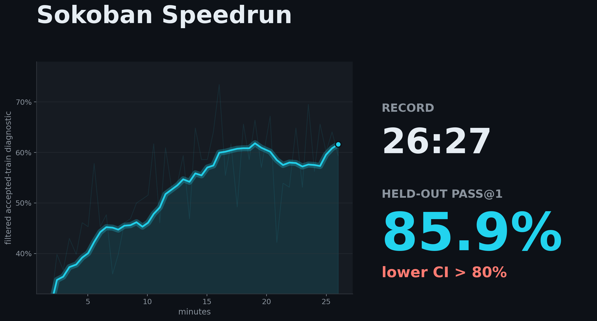
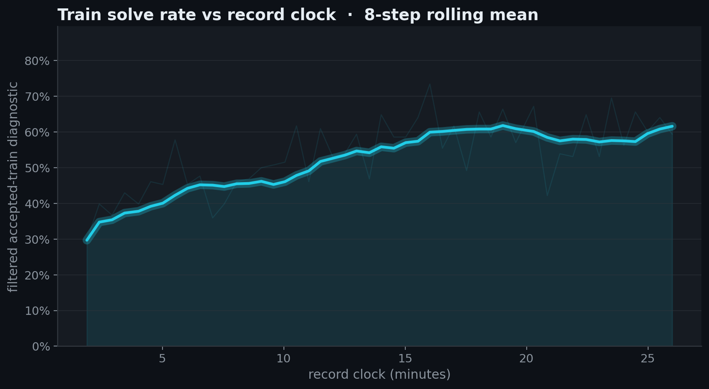
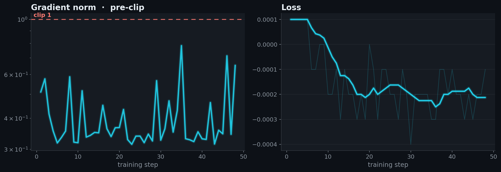
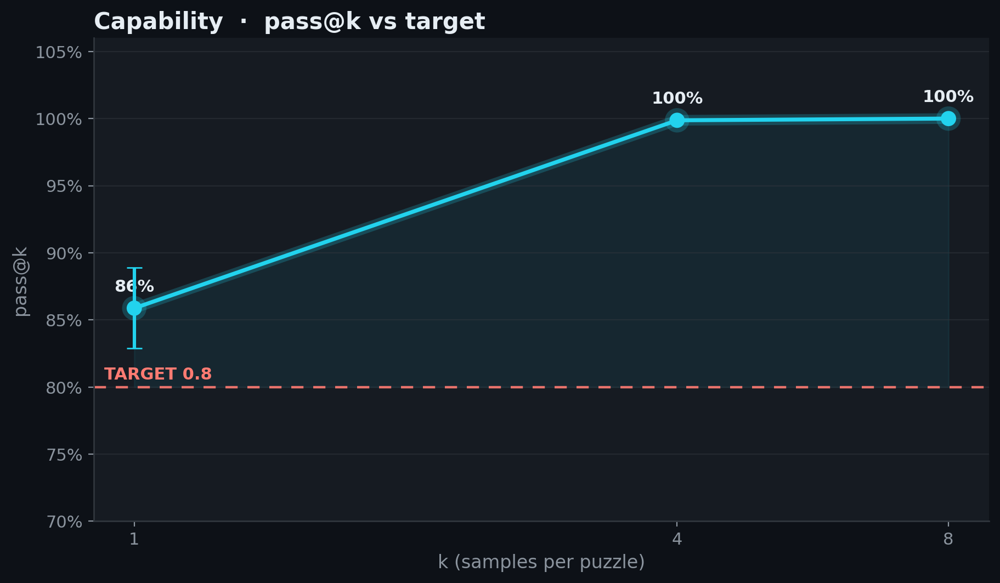

# 2026-07-02_03_grpo_48step

## Idea

This record builds on @dexhunter's Weco strategy-hook GRPO run from PR #5 and
keeps the post-#7 generator-GC behavior that prevents weight-sync stalls. The
main change is to make the run finish earlier without losing the eval gate:
shorten the rollout thinking budget from 5632 to **4800** tokens, reduce
`max_model_len` to **6144**, and train for **48** optimizer steps with the same
60-step LR decay horizon.

The token cap is the speed lever: late training still gets enough reasoning
budget to solve the task, but generation and training see shorter sequences.
A 46-step version was faster, but its seed43 held-out CI lower bound was only
0.8087. Adding two steps costs about 55 seconds and gives a cleaner margin:
seed42 reaches pass@1 0.8588 (CI [0.8287, 0.8888]) and the independent seed43
rerun reaches pass@1 0.8475 (CI [0.8150, 0.8788]).

The recipe uses the Weco advantage shaping from PR #5 together with a shorter
rollout budget and earlier stopping point.

Both timed runs were on a dedicated Prime Intellect 8×H100 SXM node
(~32.5s/step). The submission ran the shaping through PR #5's
`SOKOBAN_STRATEGY_MODULE` hook (see the source snapshots below); the landed
`speedrun.py` expresses the identical shaping through the first-class flags
introduced with record #4 (`--adv-centered-blend 0.04 --adv-difficulty-weight
0.18 --adv-difficulty-ramp 1.0 --adv-variance-boost 1.1`), so the RECIPE is
fully self-contained — no strategy module or env vars needed.

<!-- BEGIN AUTO-GENERATED by make_record_report.py — edits inside will be overwritten -->

## Results

| seed | held-out eval pass@1 | 95% CI | record clock |
|---|---|---|---|
| seed42 | 0.8588 | [0.8287, 0.8888] | 26:27 |

**Held-out eval pass@1 0.8588, lower 95% CI 0.8287 vs TARGET 0.8: CLEARS.**





<details><summary>diagnostic plots</summary>





</details>

## Verification

@lorenzflow; independent seed43 verification of the same 48-step recipe on Prime Intellect 8xH100:

- re-ran at seed43, recipe commit `e17de1b2f5` → pass@1 **0.8475** (95% CI [0.8150, 0.8788]) — **CLEARS 0.8** ✓

Confirms the recipe reproduces independently; the record time above is the submission run's, not this rerun's. Artifacts: [`verification/`](verification/).

## Source

Standalone `speedrun.py` snapshots are saved per run and checked against the embedded run-log source.

| run | seed | snapshot | sha256 |
|---|---|---|---|
| submission | seed42 | [source/speedrun_seed42.py](source/speedrun_seed42.py) | `520c6deabfd3` |
| verification | seed43 | [verification/source/speedrun_seed43.py](verification/source/speedrun_seed43.py) | `520c6deabfd3` |

## Config

| arg | value |
|---|---|
| `learning_rate` | `1.6e-06` |
| `lr_schedule` | `linear` |
| `min_lr_frac` | `0.15` |
| `lr_decay_steps` | `60` |
| `warmup_steps` | `5` |
| `cispo_eps` | `4.0` |
| `loss_normalization` | `sequence` |
| `examples_per_step` | `16` |
| `num_samples` | `8` |
| `max_new_tokens` | `4800` |
| `temperature` | `0.8` |
| `top_p` | `0.95` |
| `max_staleness` | `4` |
| `inflight_requests` | `64` |
| `interruption` | `True` |
| `interrupt_answer_tokens` | `512` |
| `max_steps` | `48` |
| `seed` | `42` |

**Changed vs [2026-07-02_02_weco_strategy_52step](../2026-07-02_02_weco_strategy_52step/):**

| arg | before | after |
|---|---|---|
| `max_model_len` | `7168` | `6144` |
| `max_new_tokens` | `5632` | `4800` |
| `max_steps` | `52` | `48` |
| `seed` | `43` | `42` |

<details><summary>full args</summary>

```json
{
  "adam_eps": "1e-15",
  "advantage_mode": "grpo",
  "attn_implementation": "flash_attention_2",
  "auto_run_name": "False",
  "cispo_eps": "4.0",
  "clip_eps_high": "0.2",
  "clip_eps_low": "0.2",
  "clip_ratio_c": "3.0",
  "compile": "False",
  "debug_assert_replica_sync": "False",
  "device": "",
  "device_batch_size": "2",
  "dtype": "float32",
  "enable_thinking": "False",
  "entropy_coef": "0.0",
  "eval_data": "datasets/sokoban_eval.jsonl",
  "examples_per_step": "16",
  "final_rollout_steps": "0",
  "grad_clip": "1.0",
  "gradient_checkpointing": "True",
  "inflight_requests": "64",
  "init_lr_frac": "0.05",
  "interrupt_answer_tokens": "512",
  "interrupt_max_tokens": "None",
  "interrupt_min_tokens": "None",
  "interrupt_temperature": "None",
  "interrupt_top_k": "None",
  "interrupt_top_p": "None",
  "interruption": "True",
  "kl_tau": "0.0",
  "learning_rate": "1.6e-06",
  "log_entropy": "False",
  "logits_chunk_size": "2048",
  "loss_fn": "grpo",
  "loss_normalization": "sequence",
  "lr_decay_start": "None",
  "lr_decay_steps": "60",
  "lr_schedule": "linear",
  "max_model_len": "6144",
  "max_new_tokens": "4800",
  "max_staleness": "4",
  "max_steps": "48",
  "min_lr_frac": "0.15",
  "model": "Qwen/Qwen3-4B-Instruct-2507",
  "num_epochs": "1",
  "num_samples": "8",
  "optimizer": "adamw",
  "output_dir": "outputs",
  "rollout_flush_every": "10",
  "run": "weco-pr5-tok4800-gc-s42-48",
  "save_every": "0",
  "save_final": "True",
  "save_rollouts": "False",
  "seed": "42",
  "temperature": "0.8",
  "top_k": "0",
  "top_p": "0.95",
  "train_autocast_dtype": "bfloat16",
  "train_data": "datasets/sokoban_train.jsonl",
  "trim_after_answer": "True",
  "trust_remote_code": "False",
  "verify_datasets_only": "False",
  "vllm_enable_chunked_prefill": "None",
  "vllm_enforce_eager": "False",
  "vllm_gpu_mem_util": "0.9",
  "vllm_long_prefill_token_threshold": "None",
  "vllm_max_long_partial_prefills": "None",
  "vllm_max_num_batched_tokens": "8192",
  "vllm_max_num_partial_prefills": "None",
  "vllm_max_num_scheduled_tokens": "None",
  "vllm_max_num_seqs": "512",
  "vllm_performance_mode": "None",
  "vllm_scheduler_reserve_full_isl": "None",
  "vllm_stream_interval": "8",
  "wandb": "False",
  "wandb_rollout_samples": "20",
  "warmup_steps": "5",
  "weight_decay": "0.01",
  "zero_variance_filter": "True"
}
```
</details>

## Reproduce

```bash
# train on one 8xH100 node (the recipe is baked into speedrun.py's RECIPE — no recipe flags)
NODE_GPUS=8 uv run torchrun --standalone --nproc_per_node=3 -m speedrun -- --run <run> --seed <seed> --no-wandb --no-save-rollouts --final-rollout-steps 0
# eval the final checkpoint under the leaderboard protocol, then verify offline
uv run python -m eval_speedrun --run <run>-final-eval --eval-checkpoint outputs/<run>/step_<final> --eval-k 8 --eval-seed 12345 --eval-limit 0 --eval-max-tokens 12288 --eval-max-model-len 16384 --eval-interruption --eval-interrupt-answer-tokens 512 --eval-vllm-dp 8 --eval-gpu-mem-util 0.9 --eval-vllm-max-num-batched-tokens 40960 --eval-vllm-max-num-seqs 32 --eval-concurrency 32
uv run python verify_record.py records/2026-07-02_03_grpo_48step
```

<!-- END AUTO-GENERATED -->

