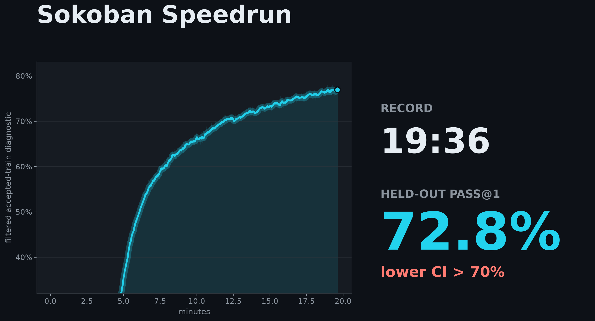
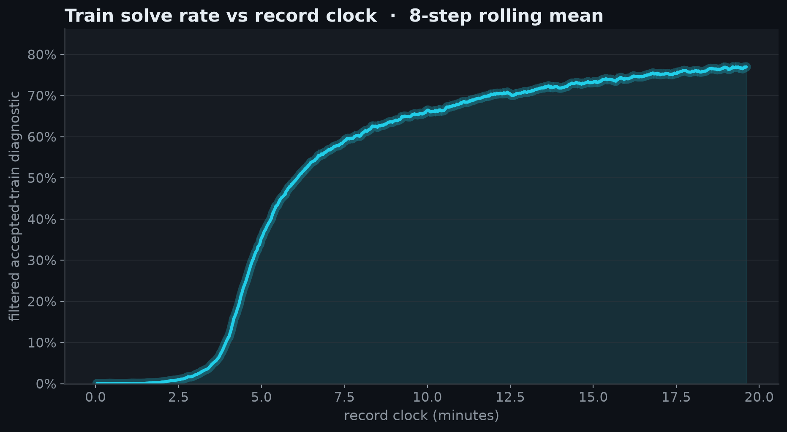
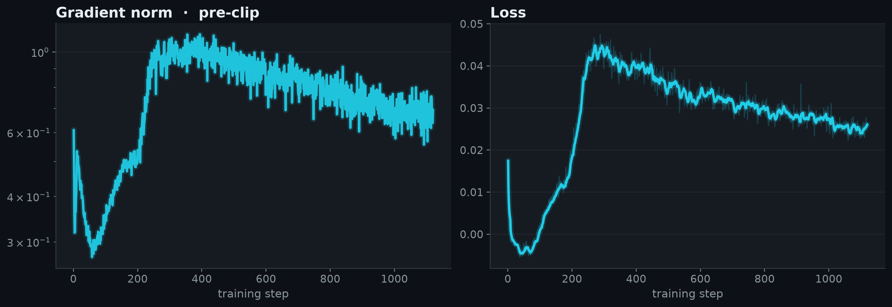
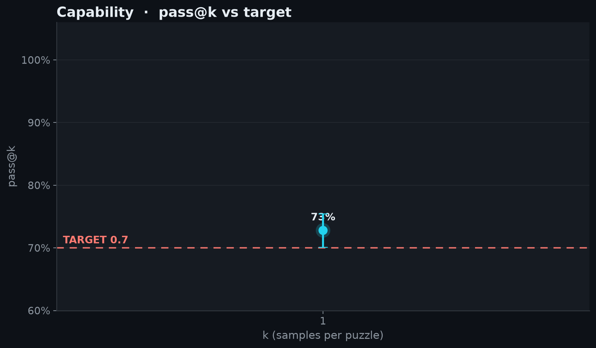

# 2026-06-21_01_non_llm

## Idea

* Actor-critic policy over the 4x10x10 Boxoban state: spatial conv encoder,
3-layer MinGRU recurrent core, h256 actor/value heads, trained in fp32.
* PPO: 8192 agents, 64-step rollouts, 120-step episodes, reward clamping, 
prioritized segment replay, V-trace GAE, clipped policy/value losses, 
entropy regularization, and gradient clipping.
* Muon optimizer with Newton-Schulz orthogonalized momentum, using tuned
Boxoban hypers from PufferLib's `boxoban.ini`; evaluated on the official
DeepMind `unfiltered/test` 1000-level held-out split by greedy per-level pass@1.

<!-- BEGIN AUTO-GENERATED by make_record_report.py — edits inside will be overwritten -->

## Results

| seed | held-out eval pass@1 | 95% CI | record clock |
|---|---|---|---|
| seed42 | 0.7279 | [0.7010, 0.7545] | 0:19:36 |

**Held-out eval pass@1 0.7279, lower 95% CI 0.7010 vs TARGET 0.7: CLEARS.**





<details><summary>diagnostic plots</summary>





</details>

## Verification

Verifier unrecorded:

- re-ran at seed123, recipe commit `f52c955747` → pass@1 **0.7335** (95% CI [0.7059, 0.7598]) — **CLEARS 0.7** ✓

Confirms the recipe reproduces independently; the record time above is the submission run's, not this rerun's. Artifacts: [`verification/`](verification/).

## Source

Standalone `speedrun_non_llm.py` snapshots are saved per run and checked against the embedded run-log source.

| run | seed | snapshot | sha256 |
|---|---|---|---|
| submission | seed42 | [source/speedrun_seed42.py](source/speedrun_seed42.py) | `fb942319e52a` |
| verification | seed123 | [verification/source/speedrun_seed123.py](verification/source/speedrun_seed123.py) | `fb942319e52a` |

## Config

| arg | value |
|---|---|
| `learning_rate` | `0.00134234` |
| `seed` | `42` |

<details><summary>full args</summary>

```json
{
  "anneal_lr": "True",
  "arch": "cnn-mingru",
  "beta1": "0.995526",
  "bf16": "False",
  "checkpoint_every": "80",
  "clip_coef": "0.01",
  "difficulty": "4",
  "ent_coef": "0.000188411",
  "env_config": "{'num_agents': 1, 'difficulty': 4, 'int_r_coeff': 0.25, 'target_loss_pen_coeff': 0, 'max_steps': 120, 'eval': 0, 'holdout_frac': 0.1}",
  "eval_checkpoint": "None",
  "eval_episodes": "16384",
  "eval_greedy": "True",
  "eval_only": "False",
  "eval_seed": "12345",
  "eval_split": "test",
  "gae_lambda": "0.759273",
  "gamma": "0.989717",
  "hidden_size": "256",
  "holdout_frac": "0.1",
  "learning_rate": "0.00134234",
  "max_episode_steps": "120",
  "max_grad_norm": "1.20325",
  "min_lr_ratio": "0.37872",
  "minibatch_size": "32768",
  "muon_eps": "1e-14",
  "no_eval": "False",
  "num_agents": "8192",
  "num_layers": "3",
  "num_params": "2249702",
  "output_dir": "/vol/outputs",
  "print_every": "40",
  "prio_alpha": "0.453827",
  "prio_beta0": "0.765589",
  "profile": "False",
  "replay_ratio": "1.6234",
  "rollout_horizon": "64",
  "run": "cnnmingru_unf_rec_s1",
  "seed": "42",
  "target": "0.7",
  "total_timesteps": "1000000000",
  "vf_clip_coef": "5.0",
  "vf_coef": "5.0",
  "vtrace_c_clip": "2.75328",
  "vtrace_rho_clip": "3.13347",
  "wandb": "True",
  "wandb_project": "sokoban-speedrun-non-llm",
  "weight_decay": "0.0"
}
```
</details>

## Reproduce

```bash
# train (recipe defaults live in speedrun_non_llm.py RECIPE)
RUN_NAME=<run> DIFFICULTY=4 TOTAL_TIMESTEPS=<steps> uv run modal run --detach modal_app_non_llm.py
# eval the final checkpoint; reuse the same EXTRA_ARGS when training used non-default config
EVAL_CHECKPOINT=/vol/outputs/<run>/final.pt DIFFICULTY=4 uv run modal run modal_app_non_llm.py
# verify offline (re-derives pass@1/CI + checks the eval bin); maintainers also rerun at a 2nd seed
uv run python verify_record.py records/2026-06-21_01_non_llm
```

<!-- END AUTO-GENERATED -->


