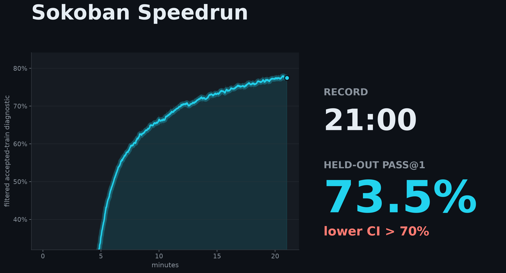
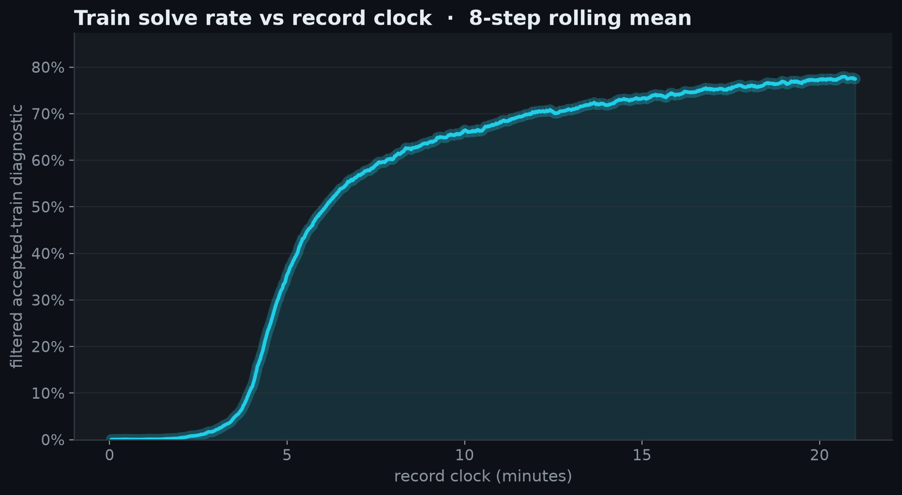
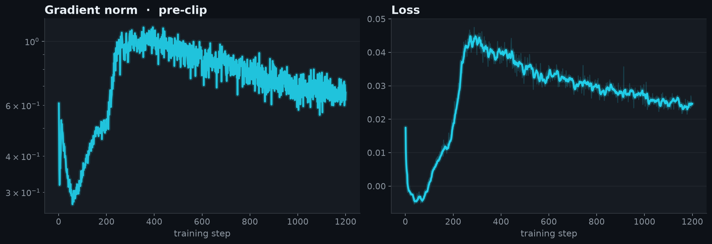
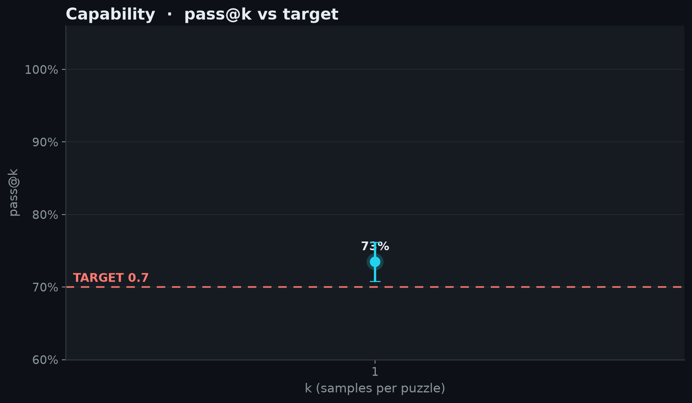

# 2026-06-29_01_non_llm

## Idea

Identical recipe to [record #1](../2026-06-21_01_non_llm/) — a 3-layer cnn-mingru
actor-critic trained with the PufferLib boxoban PPO recipe (Muon, V-trace GAE,
prioritized replay), fp32, 8192 agents. The training is unchanged; only the clock
stops earlier.

The rule is "the first checkpoint whose held-out CI clears the target," so the record
time should be the earliest clearing cut, not a later, safer one. Re-scoring the run's
80-step checkpoints on the held-out test split, the earliest cut where **both** seeds
clear `CI_low > 0.70` is iter 1200 (seed42 0.7077, seed123 0.7007) → **21:00**, versus
record #1's iter-1280 cut at 22:24. 1200 is the floor: at iter 1120 seed42 drops to
0.6971 (under the line), and held-out solve-rate only falls further below it. The wall
is held-out CI noise (~±0.01 on the lower bound — enough to flip which seed binds), not
a safety buffer.

So this is an honest re-reading of when the existing recipe first clears, not a faster
recipe. The recipe-level speedups (fewer agents, higher LR) are the next entries.

<!-- BEGIN AUTO-GENERATED by make_record_report.py — edits inside will be overwritten -->

## Results

| seed | held-out eval pass@1 | 95% CI | record clock |
|---|---|---|---|
| seed42 | 0.7348 | [0.7077, 0.7616] | 21:00 |

**Held-out eval pass@1 0.7348, lower 95% CI 0.7077 vs TARGET 0.7: CLEARS.**





<details><summary>diagnostic plots</summary>





</details>

## Verification

@JeanKaddour:

- re-ran at seed123 → pass@1 **0.7274** (95% CI [0.7007, 0.7540]) — **CLEARS 0.7** ✓

Confirms the recipe reproduces independently; the record time above is the submission run's, not this rerun's. Artifacts: [`verification/`](verification/).

## Source

Standalone `speedrun.py` snapshots are saved per run and checked against the embedded run-log source.

| run | seed | snapshot | sha256 |
|---|---|---|---|
| submission | seed42 | [source/speedrun_seed42.py](source/speedrun_seed42.py) | `fb942319e52a` |
| verification | seed123 | [verification/source/speedrun_seed123.py](verification/source/speedrun_seed123.py) | `fb942319e52a` |

## Config

| arg | value |
|---|---|
| `learning_rate` | `0.00134234` |
| `seed` | `42` |

<details><summary>full args</summary>

```json
{
  "anneal_lr": "True",
  "arch": "cnn-mingru",
  "beta1": "0.995526",
  "bf16": "False",
  "checkpoint_every": "80",
  "clip_coef": "0.01",
  "difficulty": "4",
  "ent_coef": "0.000188411",
  "env_config": "{'num_agents': 1, 'difficulty': 4, 'int_r_coeff': 0.25, 'target_loss_pen_coeff': 0, 'max_steps': 120, 'eval': 0, 'holdout_frac': 0.1}",
  "eval_checkpoint": "None",
  "eval_episodes": "16384",
  "eval_greedy": "True",
  "eval_only": "False",
  "eval_seed": "12345",
  "eval_split": "test",
  "gae_lambda": "0.759273",
  "gamma": "0.989717",
  "hidden_size": "256",
  "holdout_frac": "0.1",
  "learning_rate": "0.00134234",
  "max_episode_steps": "120",
  "max_grad_norm": "1.20325",
  "min_lr_ratio": "0.37872",
  "minibatch_size": "32768",
  "muon_eps": "1e-14",
  "no_eval": "False",
  "num_agents": "8192",
  "num_layers": "3",
  "num_params": "2249702",
  "output_dir": "/vol/outputs",
  "print_every": "40",
  "prio_alpha": "0.453827",
  "prio_beta0": "0.765589",
  "profile": "False",
  "replay_ratio": "1.6234",
  "rollout_horizon": "64",
  "run": "cnnmingru_unf_rec_s1",
  "seed": "42",
  "target": "0.7",
  "total_timesteps": "1000000000",
  "vf_clip_coef": "5.0",
  "vf_coef": "5.0",
  "vtrace_c_clip": "2.75328",
  "vtrace_rho_clip": "3.13347",
  "wandb": "True",
  "wandb_project": "sokoban-speedrun-non-llm",
  "weight_decay": "0.0"
}
```
</details>

## Reproduce

```bash
# train (recipe defaults live in speedrun.py RECIPE)
RUN_NAME=<run> DIFFICULTY=4 TOTAL_TIMESTEPS=<steps> uv run modal run --detach modal_app_non_llm.py
# eval the final checkpoint; reuse the same EXTRA_ARGS when training used non-default config
EVAL_CHECKPOINT=/vol/outputs/<run>/final.pt DIFFICULTY=4 uv run modal run modal_app_non_llm.py
# verify offline (re-derives pass@1/CI + checks the eval bin); maintainers also rerun at a 2nd seed
uv run python verify_record.py records/2026-06-29_01_non_llm
```

<!-- END AUTO-GENERATED -->

