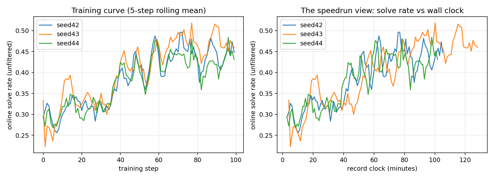
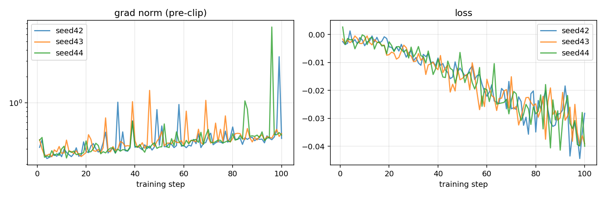
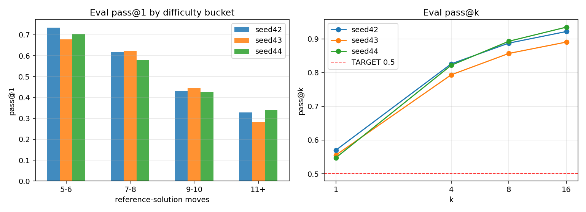

# Record 1 — CISPO, LR 8e-7 annealed to 1.2e-7

## Idea

The baseline recipe that the benchmark ships with ([ScaleRL](https://arxiv.org/abs/2510.13786)-flavored).

- **CISPO** (clipped importance-sampling weights, no KL anchor) with sample-level loss normalization — tolerant of the mild off-policyness the async generator/trainer split produces (ESS stays ≥0.999 throughout).
- **LR annealed to a floor**: peak 8e-7 (5-step warmup), linear decay to a 1.2e-7 floor by step 90. In earlier ablations, constant LR collapses shortly past ~100 steps (grad-norm runaway) and decay-to-zero undertrains; the nonzero floor is the stable middle path.
- **Forced-answer interruption**: rollouts that hit the 5,632-token thinking cap get `</think><answer>` injected and emit only a move string — ~99.6% of interrupted samples produce a scoreable answer instead of a guaranteed zero.
- fp32 master weights with bf16 generation; 16 groups × 8 samples per step; 100 steps consume ~2,300 rows of the curriculum.

All three seeds were stable end-to-end (no collapse, zero stale drops, truncation ≈ 0). The spread in record clocks below is node lottery, not recipe variance.

<!-- BEGIN AUTO-GENERATED by make_record_report.py — edits inside will be overwritten -->

## Results

| seed | pass@1 | 95% CI | record clock |
|---|---|---|---|
| seed42 | 0.5700 | [0.5371, 0.6022] | 1:45:38 |
| seed43 | 0.5554 | [0.5211, 0.5898] | 2:08:59 |
| seed44 | 0.5475 | [0.5156, 0.5785] | 1:42:20 |

**Mean pass@1 0.5576 ± 0.0114 over 3 seeds vs TARGET 0.5: t = 8.76, one-sided p = 0.00639.**







## Config

| arg | value |
|---|---|
| `learning_rate` | `8e-07` |
| `lr_schedule` | `linear` |
| `min_lr_frac` | `0.15` |
| `lr_decay_steps` | `90` |
| `warmup_steps` | `5` |
| `cispo_eps` | `4.0` |
| `loss_normalization` | `sequence` |
| `examples_per_step` | `16` |
| `num_samples` | `8` |
| `max_new_tokens` | `5632` |
| `temperature` | `0.8` |
| `top_p` | `0.95` |
| `max_staleness` | `4` |
| `inflight_requests` | `64` |
| `interruption` | `True` |
| `interrupt_answer_tokens` | `512` |
| `max_steps` | `100` |
| `seed` | `42` |

<details><summary>full args</summary>

```json
{
  "adam_eps": "1e-15",
  "attn_implementation": "flash_attention_2",
  "cispo_eps": "4.0",
  "compile": "False",
  "debug_assert_replica_sync": "False",
  "device": "",
  "device_batch_size": "2",
  "dtype": "float32",
  "enable_thinking": "True",
  "eval_alpha": "0.01",
  "eval_checkpoint": "None",
  "eval_concurrency": "1024",
  "eval_data": "datasets/sokoban_eval.jsonl",
  "eval_gpu_mem_util": "0.85",
  "eval_interrupt_answer_tokens": "512",
  "eval_interrupt_temperature": "None",
  "eval_interrupt_top_k": "None",
  "eval_interrupt_top_p": "None",
  "eval_interruption": "False",
  "eval_k": "16",
  "eval_limit": "None",
  "eval_max_model_len": "8192",
  "eval_max_tokens": "6144",
  "eval_only": "False",
  "eval_output": "None",
  "eval_save_rollouts": "True",
  "eval_seed": "12345",
  "eval_step": "None",
  "eval_target": "0.5",
  "eval_temperature": "0.8",
  "eval_top_k": "0",
  "eval_top_p": "0.95",
  "eval_vllm_dp": "1",
  "eval_vllm_enable_chunked_prefill": "None",
  "eval_vllm_enforce_eager": "False",
  "eval_vllm_long_prefill_token_threshold": "None",
  "eval_vllm_max_long_partial_prefills": "None",
  "eval_vllm_max_num_batched_tokens": "16384",
  "eval_vllm_max_num_partial_prefills": "None",
  "eval_vllm_max_num_scheduled_tokens": "None",
  "eval_vllm_max_num_seqs": "1024",
  "eval_vllm_performance_mode": "None",
  "eval_vllm_scheduler_reserve_full_isl": "None",
  "eval_vllm_stream_interval": "None",
  "examples_per_step": "16",
  "final_rollout_steps": "10",
  "grad_clip": "1.0",
  "gradient_checkpointing": "True",
  "inflight_requests": "64",
  "init_lr_frac": "0.05",
  "inloop_eval_deadline_steps": "5",
  "inloop_eval_every": "0",
  "inloop_eval_interrupt_answer_tokens": "512",
  "inloop_eval_interruption": "False",
  "inloop_eval_k": "4",
  "inloop_eval_max_tokens": "6144",
  "inloop_eval_seed": "12345",
  "interrupt_answer_tokens": "512",
  "interrupt_max_tokens": "None",
  "interrupt_min_tokens": "None",
  "interrupt_temperature": "None",
  "interrupt_top_k": "None",
  "interrupt_top_p": "None",
  "interruption": "True",
  "kl_tau": "0.0",
  "learning_rate": "8e-07",
  "logits_chunk_size": "2048",
  "loss_normalization": "sequence",
  "lr_decay_start": "None",
  "lr_decay_steps": "90",
  "lr_schedule": "linear",
  "max_model_len": "7168",
  "max_new_tokens": "5632",
  "max_staleness": "4",
  "max_steps": "100",
  "min_lr_frac": "0.15",
  "model": "Qwen/Qwen3-4B",
  "num_epochs": "1",
  "num_samples": "8",
  "optimizer": "adamw",
  "output_dir": "outputs",
  "rollout_flush_every": "10",
  "run": "sokoban-v8-datasetv2-seed42-20260610",
  "save_every": "0",
  "save_final": "True",
  "save_rollouts": "True",
  "seed": "42",
  "temperature": "0.8",
  "top_k": "0",
  "top_p": "0.95",
  "train_autocast_dtype": "bfloat16",
  "train_data": "datasets/sokoban_train.jsonl",
  "trim_after_answer": "True",
  "trust_remote_code": "False",
  "verify_datasets_only": "False",
  "vllm_enable_chunked_prefill": "None",
  "vllm_enforce_eager": "False",
  "vllm_gpu_mem_util": "0.9",
  "vllm_long_prefill_token_threshold": "None",
  "vllm_max_long_partial_prefills": "None",
  "vllm_max_num_batched_tokens": "8192",
  "vllm_max_num_partial_prefills": "None",
  "vllm_max_num_scheduled_tokens": "None",
  "vllm_max_num_seqs": "512",
  "vllm_performance_mode": "None",
  "vllm_scheduler_reserve_full_isl": "None",
  "vllm_stream_interval": "8",
  "wandb_rollout_samples": "20",
  "warmup_steps": "5",
  "weight_decay": "0.01",
  "zero_variance_filter": "True"
}
```
</details>

## Reproduce

```bash
MAX_STEPS=100 FINAL_EVAL_K=16 FINAL_EVAL_LIMIT=0 RUN_NAME=<run> modal run --detach modal_app.py
python verify_record.py records/2026-06-11_01_cispo
```

<!-- END AUTO-GENERATED -->

