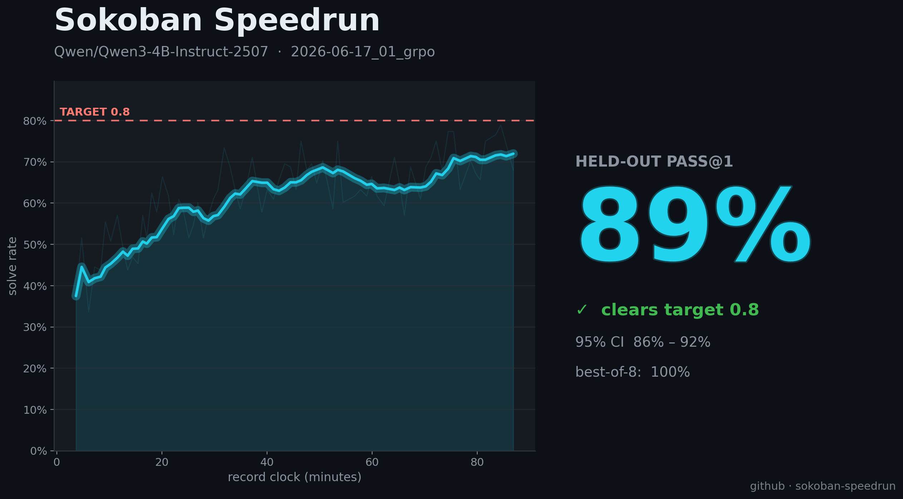
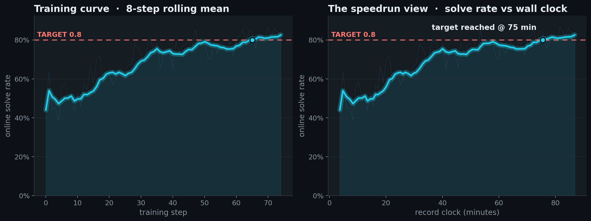
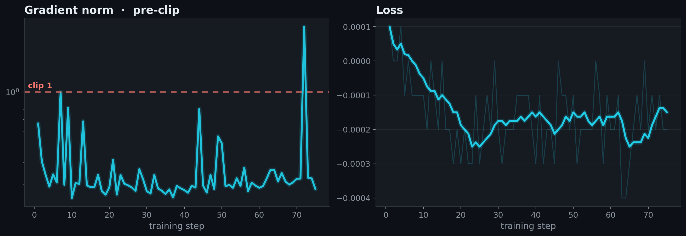
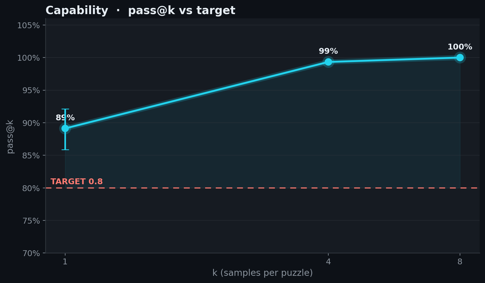

# 2026-06-17_01_grpo

## Plain GRPO

- **Recipe:** plain GRPO objective, 8 samples per puzzle, 16 puzzles per step. A puzzle group is filtered when all 8 rewards are equal, because GRPO gives it zero advantage; the collector keeps consuming fresh groups until the step has 16 signal-bearing groups.
- **Rollout control:** training uses [ScaleRL](https://arxiv.org/abs/2510.13786)-style interruptions. Each sample first gets a `5632`-token generation budget; if it hits the cap, the runner appends the final-answer marker and grants another `512` answer tokens. The injected marker stays in context for the answer continuation but is masked out of the policy-gradient loss, so overlong samples can still produce scoreable answers without training on synthetic marker tokens.
- **GRPO details:** the submitted run passes `--loss-fn grpo` on top of the `speedrun.py` recipe. That selects PPO/GRPO token-ratio clipping with `clip_eps_low=0.2`, `clip_eps_high=0.2`, dual-clip `clip_ratio_c=3.0`, GRPO group advantages `(reward - group_mean) / group_std`, and `loss_normalization=sequence` so each completion is averaged over its own trainable tokens before the batch average.
- **Async pipeline:** the 8xH100 node runs 3 trainer ranks and 5 vLLM generators. Rollouts are consumed in dataset order, `inflight_requests=64` bounds the amount of queued work, and `max_staleness=4` drops completions generated by older policy versions before they can enter a training step.
- **Precision and memory:** trainer parameters and LM-head/logits are kept in fp32, while the transformer body uses bf16 autocast. `device_batch_size=2`, gradient checkpointing, and `logits_chunk_size=2048` keep the 4B fp32 trainer inside 80GB H100 memory.
- **ScaleRL influence:** this is not the full ScaleRL recipe; it keeps GRPO plus sequence/sample-level aggregation rather than CISPO plus prompt-level aggregation. The borrowed stabilizers are interruption-based length control, fp32 logits, zero-variance filtering, and bounded asynchronous off-policy training.
- **Schedule:** LR `1.6e-6`, 5-step warmup from 5% of peak, linear decay to a non-zero 15% floor. The record run overrides the recipe's default decay horizon to `75` steps, matching the 75-step run.
- **Result:** held-out eval pass@1 **0.891**, pass@8 **1.00**, record time **1:27:31**.

<!-- BEGIN AUTO-GENERATED by make_record_report.py — edits inside will be overwritten -->

## Results

| seed | held-out eval pass@1 | 95% CI | record clock | FLOPs |
|---|---|---|---|---|
| seed43 | 0.8912 | [0.8588, 0.9213] | 1:27:31 | 1.251 EFLOP |

**Held-out eval pass@1 0.8912, lower 95% CI 0.8588 vs TARGET 0.8: CLEARS.**





<details><summary>diagnostic plots</summary>





</details>

## Verification

Self-verified by @JeanKaddour:

- re-ran at seed42 → pass@1 **0.8675** (95% CI [0.8287, 0.9025]) — **CLEARS 0.8** ✓

Confirms the recipe reproduces independently; the record time above is the submission run's, not this rerun's. Artifacts: [`verification/`](verification/).

## Source

Standalone `speedrun.py` snapshots are saved per run and checked against the embedded run-log source.

| run | seed | snapshot | sha256 |
|---|---|---|---|
| submission | seed43 | [source/speedrun_seed43.py](source/speedrun_seed43.py) | `cc3a520cdddc` |
| verification | seed42 | [verification/source/speedrun_seed42.py](verification/source/speedrun_seed42.py) | `cc3a520cdddc` |

## Config

| arg | value |
|---|---|
| `learning_rate` | `1.6e-06` |
| `lr_schedule` | `linear` |
| `min_lr_frac` | `0.15` |
| `lr_decay_steps` | `75` |
| `warmup_steps` | `5` |
| `cispo_eps` | `4.0` |
| `loss_normalization` | `sequence` |
| `examples_per_step` | `16` |
| `num_samples` | `8` |
| `max_new_tokens` | `5632` |
| `temperature` | `0.8` |
| `top_p` | `0.95` |
| `max_staleness` | `4` |
| `inflight_requests` | `64` |
| `interruption` | `True` |
| `interrupt_answer_tokens` | `512` |
| `max_steps` | `75` |
| `seed` | `43` |

<details><summary>full args</summary>

```json
{
  "adam_eps": "1e-15",
  "advantage_mode": "grpo",
  "attn_implementation": "flash_attention_2",
  "cispo_eps": "4.0",
  "clip_eps_high": "0.2",
  "clip_eps_low": "0.2",
  "clip_ratio_c": "3.0",
  "compile": "False",
  "debug_assert_replica_sync": "False",
  "device": "",
  "device_batch_size": "2",
  "dtype": "float32",
  "enable_thinking": "False",
  "entropy_coef": "0.0",
  "eval_alpha": "0.01",
  "eval_checkpoint": "None",
  "eval_concurrency": "1024",
  "eval_data": "datasets/sokoban_eval.jsonl",
  "eval_gpu_mem_util": "0.85",
  "eval_interrupt_answer_tokens": "512",
  "eval_interrupt_min_p": "None",
  "eval_interrupt_temperature": "None",
  "eval_interrupt_top_k": "None",
  "eval_interrupt_top_p": "None",
  "eval_interruption": "False",
  "eval_k": "16",
  "eval_limit": "None",
  "eval_max_model_len": "8192",
  "eval_max_tokens": "6144",
  "eval_min_p": "0.0",
  "eval_only": "False",
  "eval_output": "None",
  "eval_save_rollouts": "True",
  "eval_seed": "12345",
  "eval_step": "None",
  "eval_target": "0.8",
  "eval_temperature": "0.8",
  "eval_top_k": "0",
  "eval_top_p": "0.95",
  "eval_vllm_dp": "1",
  "eval_vllm_enable_chunked_prefill": "None",
  "eval_vllm_enforce_eager": "False",
  "eval_vllm_long_prefill_token_threshold": "None",
  "eval_vllm_max_long_partial_prefills": "None",
  "eval_vllm_max_num_batched_tokens": "16384",
  "eval_vllm_max_num_partial_prefills": "None",
  "eval_vllm_max_num_scheduled_tokens": "None",
  "eval_vllm_max_num_seqs": "1024",
  "eval_vllm_performance_mode": "None",
  "eval_vllm_scheduler_reserve_full_isl": "None",
  "eval_vllm_stream_interval": "None",
  "examples_per_step": "16",
  "final_rollout_steps": "10",
  "grad_clip": "1.0",
  "gradient_checkpointing": "True",
  "inflight_requests": "64",
  "init_lr_frac": "0.05",
  "inloop_eval_deadline_steps": "5",
  "inloop_eval_every": "0",
  "inloop_eval_interrupt_answer_tokens": "512",
  "inloop_eval_interruption": "False",
  "inloop_eval_k": "4",
  "inloop_eval_max_tokens": "6144",
  "inloop_eval_seed": "12345",
  "interrupt_answer_tokens": "512",
  "interrupt_max_tokens": "None",
  "interrupt_min_tokens": "None",
  "interrupt_temperature": "None",
  "interrupt_top_k": "None",
  "interrupt_top_p": "None",
  "interruption": "True",
  "kl_tau": "0.0",
  "learning_rate": "1.6e-06",
  "log_entropy": "False",
  "logits_chunk_size": "2048",
  "loss_fn": "grpo",
  "loss_normalization": "sequence",
  "lr_decay_start": "None",
  "lr_decay_steps": "75",
  "lr_schedule": "linear",
  "max_model_len": "7168",
  "max_new_tokens": "5632",
  "max_staleness": "4",
  "max_steps": "75",
  "min_lr_frac": "0.15",
  "model": "Qwen/Qwen3-4B-Instruct-2507",
  "num_epochs": "1",
  "num_samples": "8",
  "optimizer": "adamw",
  "output_dir": "outputs",
  "rollout_flush_every": "10",
  "run": "record-grpo-d12-seed43",
  "save_every": "0",
  "save_final": "True",
  "save_rollouts": "True",
  "seed": "43",
  "temperature": "0.8",
  "top_k": "0",
  "top_p": "0.95",
  "train_autocast_dtype": "bfloat16",
  "train_data": "datasets/sokoban_train.jsonl",
  "trim_after_answer": "True",
  "trust_remote_code": "False",
  "verify_datasets_only": "False",
  "vllm_enable_chunked_prefill": "None",
  "vllm_enforce_eager": "False",
  "vllm_gpu_mem_util": "0.9",
  "vllm_long_prefill_token_threshold": "None",
  "vllm_max_long_partial_prefills": "None",
  "vllm_max_num_batched_tokens": "8192",
  "vllm_max_num_partial_prefills": "None",
  "vllm_max_num_scheduled_tokens": "None",
  "vllm_max_num_seqs": "512",
  "vllm_performance_mode": "None",
  "vllm_scheduler_reserve_full_isl": "None",
  "vllm_stream_interval": "8",
  "wandb_rollout_samples": "20",
  "warmup_steps": "5",
  "weight_decay": "0.01",
  "zero_variance_filter": "True"
}
```
</details>

## Reproduce

```bash
# train (recipe defaults live in speedrun.py RECIPE + modal_app.py)
MAX_STEPS=<steps> RUN_NAME=<run> modal run --detach modal_app.py
# eval the final checkpoint under the leaderboard protocol, then verify offline
EVAL_CHECKPOINT=/vol/outputs/<run>/step_<final> modal run modal_app.py
python verify_record.py records/2026-06-17_01_grpo
```

<!-- END AUTO-GENERATED -->
